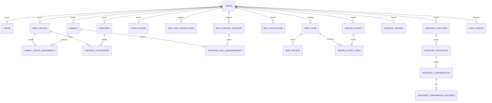

# Modelo de dados proposto

> **Superado.** Este documento foi uma proposta de discussão anterior às decisões
> registradas em `DECISIONS.md` (D-017 a D-032). O modelo vigente está em
> `ONTOLOGY.md` e no schema real em `app/src/db/schema.ts`. Mantido apenas como
> histórico.

Status: proposta para discussão. Campos marcados como **pendentes** dependem das
respostas em `DISCOVERY_QUESTIONS.md`.

## Princípios

- PostgreSQL é a fonte oficial.
- A Fazenda é a raiz de propriedade, mas não um aggregate gigante.
- Toda tabela operacional contém `farm_id`.
- IDs públicos são UUID/UUIDv7 ou outro identificador opaco.
- Datas civis usam `date`; instantes usam `timestamptz`.
- Dinheiro usa centavos inteiros em BRL no V1.
- Quantidades usam `numeric` e unidade explícita.
- JSONB é aceito para payload versionado de IA; não substitui colunas
  consultadas ou invariantes relacionais.
- Geometrias usam PostGIS. GeoJSON é formato de transporte, não persistência.
- Históricos são intervalos/eventos datados, não apenas “estado atual”.
- Fatos confirmados não são apagados silenciosamente.

## Visão relacional



## Colunas transversais

Tabelas mutáveis usam:

```text
id
farm_id
created_at
created_by_user_id
updated_at
updated_by_user_id
archived_at? / cancelled_at?
```

`audit_events` é a história de mutações; timestamps na entidade não a
substituem.

## Integridade entre Fazendas

Adicionar `UNIQUE (farm_id, id)` nas entidades que serão referenciadas por
filhos e usar foreign keys compostas:

```text
individual_milk_measurements
  (farm_id, session_id) → milk_control_sessions (farm_id, id)
  (farm_id, animal_id)  → animals (farm_id, id)
```

Esse padrão impede uma referência cross-farm mesmo que um filtro da aplicação
falhe. Repositórios continuam filtrando por Fazenda; a constraint é defesa em
profundidade.

## Identidade

### `farms`

| Campo | Tipo | Regra |
| --- | --- | --- |
| `id` | uuid | PK |
| `name` | text | obrigatório |
| `timezone` | text | default `America/Sao_Paulo` |
| `currency` | char(3) | default `BRL` |
| `boundary` | geometry(Polygon, 4326) nullable | perímetro válido |
| `created_at`, `updated_at` | timestamptz | obrigatórios |

### `users`

| Campo | Tipo | Regra |
| --- | --- | --- |
| `id` | uuid | PK interna |
| `farm_id` | uuid | FK, `NOT NULL`, `UNIQUE` no V1 |
| `auth_subject` | text | ID do provedor, globalmente único |
| `email` | citext/text | globalmente único e normalizado |
| `display_name` | text | obrigatório |
| `active` | boolean | default true |
| timestamps | timestamptz | obrigatórios |

Criar Usuário e Fazenda em uma única transação de provisionamento. O cliente
nunca escolhe `farm_id` em requests operacionais.

## Rebanho

### `animals`

| Campo | Tipo | Regra |
| --- | --- | --- |
| `id`, `farm_id` | uuid | PK e FK |
| `identifier` | text | brinco/código; único por Fazenda quando informado |
| `name` | text nullable | nome conhecido |
| `operational_status` | enum | proposta: `ACTIVE`, `INACTIVE` |
| `milk_eligible` | boolean | **pendente**; alternativa simples a ciclo reprodutivo |
| `sex` | enum nullable | **pendente** |
| `notes` | text nullable | livre, sem informação estrutural escondida |
| auditoria | colunas | obrigatórias |

Constraint: `identifier` ou `name` deve existir. Arquivar não apaga medições.

### `herd_groups`

| Campo | Tipo | Regra |
| --- | --- | --- |
| `id`, `farm_id` | uuid | PK e FK |
| `name` | text | único por Fazenda entre ativos |
| `milking_schedule` | enum | **pendente**: nenhuma, manhã, manhã+tarde |
| `active` | boolean | default true |
| auditoria | colunas | obrigatórias |

### `animal_group_assignments`

| Campo | Tipo | Regra |
| --- | --- | --- |
| `id`, `farm_id` | uuid | PK e escopo |
| `animal_id`, `herd_group_id` | uuid | mesma Fazenda |
| `started_on` | date | obrigatório |
| `ended_on` | date nullable | maior ou igual ao início |
| `notes` | text nullable | opcional |

Índice parcial: no máximo uma Lotação aberta por Animal.

## Espaço físico

As geometrias PostGIS próprias são os dados oficiais. A imagem de satélite é
fornecida por uma camada cartográfica externa e não deve ser copiada para o
banco nem usada para inferir automaticamente limite, Pasto, Instalação ou
Ocupação. A API pode receber e devolver GeoJSON.

### `farm_boundaries`

| Campo | Tipo | Regra |
| --- | --- | --- |
| `id`, `farm_id` | text | PK e Fazenda proprietária |
| `name` | text | rótulo operacional |
| `boundary` | geometry(Polygon, 4326) | único por Fazenda e válido |

O seed real do `sitio-cafezinho` importa o perímetro e os Pastos, mas não
importa Instalações nem Ocupações: não há correspondência confiável para esses
fatos na fonte fornecida.

### `pastures`

| Campo | Tipo | Regra |
| --- | --- | --- |
| `id`, `farm_id` | uuid | PK e escopo |
| `name` | text | único por Fazenda entre ativos |
| `boundary` | geometry(Polygon, 4326) | polígono válido |
| `area_hectares` | numeric nullable | informado ou derivado, origem explícita |
| `active` | boolean | default true |
| auditoria | colunas | obrigatórias |

### `installations`

| Campo | Tipo | Regra |
| --- | --- | --- |
| `id`, `farm_id` | uuid | PK e escopo |
| `kind` | enum/text controlado | tipos reais a decidir |
| `name` | text | único por Fazenda entre ativas |
| `position` | geometry(Point, 4326) | ponto válido |
| `active` | boolean | default true |
| auditoria | colunas | obrigatórias |

### `pasture_occupancies`

| Campo | Tipo | Regra |
| --- | --- | --- |
| `id`, `farm_id` | uuid | PK e escopo |
| `pasture_id`, `herd_group_id` | uuid | mesma Fazenda |
| `started_on`, `ended_on` | date/date nullable | intervalo válido |
| `notes` | text nullable | opcional |

Índices parciais: no máximo uma ocupação aberta por Pasto e por Lote, se essa
regra for confirmada.

## Leite

### `daily_milk_productions`

| Campo | Tipo | Regra |
| --- | --- | --- |
| `id`, `farm_id` | uuid | PK e escopo |
| `production_date` | date | obrigatório |
| `herd_group_id` | uuid nullable | null significa Fazenda toda |
| `morning_liters` | numeric nullable | não negativo |
| `afternoon_liters` | numeric nullable | não negativo |
| `total_liters` | numeric | consistente com os períodos informados |
| `notes` | text nullable | opcional |
| origem/auditoria | colunas | manual ou Confirmação |

Unicidade por Fazenda/data/escopo. Total geral e totais por Lote podem coexistir.

### `milk_control_sessions`

| Campo | Tipo | Regra |
| --- | --- | --- |
| `id`, `farm_id` | uuid | PK e escopo |
| `session_date` | date | obrigatório |
| `herd_group_id` | uuid nullable | **pendente** |
| `title`, `notes` | text nullable | opcionais |
| auditoria | colunas | obrigatórias |

### `individual_milk_measurements`

| Campo | Tipo | Regra |
| --- | --- | --- |
| `id`, `farm_id` | uuid | PK e escopo |
| `session_id`, `animal_id` | uuid | mesma Fazenda |
| `morning_liters` | numeric nullable | não negativo |
| `afternoon_liters` | numeric nullable | não negativo |
| `total_liters` | numeric | consistente com os períodos |
| `raw_animal_label` | text nullable | preservado quando veio de Captura |
| `raw_value_text` | text nullable | preservado quando veio de Captura |
| `notes` | text nullable | opcional |
| auditoria | colunas | obrigatórias |

Unicidade por Sessão/Animal. Linhas não resolvidas continuam como Propostas e
não entram nesta tabela.

### `milk_collections`

| Campo | Tipo | Regra |
| --- | --- | --- |
| `id`, `farm_id` | uuid | PK e escopo |
| `collected_at` | timestamptz | obrigatório ou data+hora parcial **pendente** |
| `liters` | numeric | maior que zero |
| `source` | enum | leitura do tanque, comprovante, outro |
| `notes` | text nullable | opcional |
| auditoria | colunas | obrigatórias |

Várias Coletas podem ocorrer no mesmo dia.

## Análise leiteira derivada

Não criar tabela de “melhores Animais” nem gravar ranking como fato. Calcular a
partir de Medições confirmadas:

- média, mediana, mínimo e máximo no período;
- quantidade de Controles com Medição;
- primeira e última Medição do período;
- variação entre janelas comparáveis, somente após definir a regra;
- posição relativa no Lote/Fazenda, quando a Cobertura mínima for atingida.

Toda resposta analítica carrega:

```text
period_start
period_end
measurement_count
expected_control_count?   // quando for possível definir
coverage_ratio?
comparison_scope          // Fazenda ou Lote
calculation_version
limitations[]
```

Para Produção diária, evolução usa somente dias realmente medidos e informa
quantos dias do período possuem dados. Para Animais, não preencher Controles
ausentes nem comparar como equivalentes períodos com cobertura insuficiente.

Começar com queries/views normais. Materialized view ou tabela de projeção só
entra após medir custo real. Nenhuma métrica recebe o nome de qualidade ou
mérito genético no V1.

## Alimentação

### `feed_items`

`id`, `farm_id`, `name`, `canonical_unit` (`KG`, `LITER`, `UNIT`), `active` e
auditoria. Nome único por Fazenda entre ativos. Unidade não muda após o primeiro
movimento.

### `feed_entries`

Entrada positiva de estoque: `feed_item_id`, `quantity`, `occurred_on`,
`origin` (`PURCHASE`, `INITIAL_BALANCE`, `PRODUCED`, `RETURN`, `ADJUSTMENT`),
`financial_entry_id?`, notas e auditoria.

As origens definitivas dependem da rotina real. Uma Entrada originada por compra
pode apontar para uma Despesa, mas continua sendo fato de estoque distinto.

### `feeding_events`

`id`, `farm_id`, `occurred_on`, `herd_group_id?`, `installation_id?`, notas e
auditoria. A regra de destino obrigatório será decidida nas entrevistas.

### `feeding_event_items`

`feeding_event_id`, `feed_item_id`, `quantity` positiva. Unicidade por
Trato/Alimento.

### `feed_adjustments`

Ajuste explícito e raro com `quantity_delta`, motivo obrigatório e auditoria.
Não editar saldo nem reescrever movimentos antigos.

Saldo = Entradas − Itens do trato + Ajustes. Implementar como query/view, não
coluna mutável.

## Financeiro

### `financial_entries`

Modelo recomendado sem liquidação parcial:

| Campo | Tipo | Regra |
| --- | --- | --- |
| `id`, `farm_id` | uuid | PK e escopo |
| `direction` | enum | `INCOME` ou `EXPENSE` |
| `description` | text | obrigatório |
| `category` | text/enum | lista curta e configurável **pendente** |
| `occurred_on` | date | data do fato |
| `due_on` | date nullable | vencimento |
| `amount_cents` | bigint | maior que zero |
| `status` | enum | `OPEN`, `SETTLED`, `CANCELLED` |
| `settled_at` | timestamptz nullable | obrigatório quando liquidado |
| `counterparty_name` | text nullable | fornecedor/comprador sem cadastro V1 |
| `notes` | text nullable | opcional |
| auditoria | colunas | obrigatórias |

Se pagamentos parciais forem indispensáveis, substituir `settled_at` por
`financial_settlements`; não manter os dois modelos.

## Assistente e arquivos

### `stored_files`

`id`, `farm_id` e metadados/estado de upload: nome original, MIME, tamanho,
hash, provider, object key, status e timestamps. Binário nunca fica no
PostgreSQL.

### `assistant_captures`

`id`, `farm_id`, `created_by_user_id`, `input_kind`, `status`, texto/transcrição
bruta quando permitido, modelo, versão, tokens, custo, latência, `error_code`,
timestamps e arquivos associados.

### `assistant_capture_files`

`capture_id`, `stored_file_id`, `ordinal` e `role`. Preserva a ordem de várias
fotos/documentos sem colocar várias FKs opcionais na Captura.

### `assistant_proposals`

`id`, `farm_id`, `capture_id`, `intent_type`, `schema_version`,
`proposed_payload` JSONB, `issues` JSONB com códigos estáveis, status e
timestamps.

Cada intent possui schema validado na borda. O JSONB não é usado diretamente
como Registro de domínio.

### `assistant_confirmations`

`id`, `farm_id`, `proposal_id` único, `confirmed_by_user_id`, `confirmed_at`,
`idempotency_key`, hash do comando e resumo de correções.

### `assistant_confirmation_records`

`confirmation_id`, `record_type`, `record_id`. Permite que uma Confirmação crie
uma sessão e muitas medições sem fingir que existe apenas um resultado.

## Integridade operacional

### `idempotency_records`

Escopo Fazenda/Usuário, chave, nome do comando, hash do request, status, resposta
serializada mínima e expiração. Constraint única no escopo.

### `audit_events`

Conforme `OBSERVABILITY.md`. Append-only na aplicação; acesso administrativo
restrito.

## Índices obrigatórios

- Começar índices compostos por `farm_id`.
- Usar índices GiST nas geometrias consultadas.
- Índices de listas por `farm_id, occurred_on/date DESC`.
- Busca de Animal por `farm_id, identifier` e nome normalizado.
- Pendências do Assistente por `farm_id, status, created_at`.
- Financeiro por `farm_id, status, due_on`.
- Não indexar todo JSONB; criar índice apenas para consulta comprovada.

## Exclusão e retenção

- Fazenda/Usuário: política legal e operacional ainda pendente.
- Animal/Lote/Pasto/Instalação: arquivar, não apagar histórico.
- Fatos de leite, trato e financeiro: cancelar/corrigir com auditoria.
- Proposta descartada: reter metadados conforme política.
- Arquivo bruto: retenção separada e menor quando possível.
- Audit events: retenção maior que logs técnicos.

## Migração do MVP

Classificar cada linha como:

1. `MIGRATED`: possui correspondência inequívoca;
2. `NEEDS_REVIEW`: depende de escolha humana;
3. `ARCHIVED_OUT_OF_SCOPE`: domínio removido;
4. `REJECTED`: viola invariantes, com motivo.

Gerar relatório por tabela e nunca inventar `farm_id`, Animal, data, Lote ou
valor ausente. Criar a Fazenda de destino explicitamente antes da importação.
