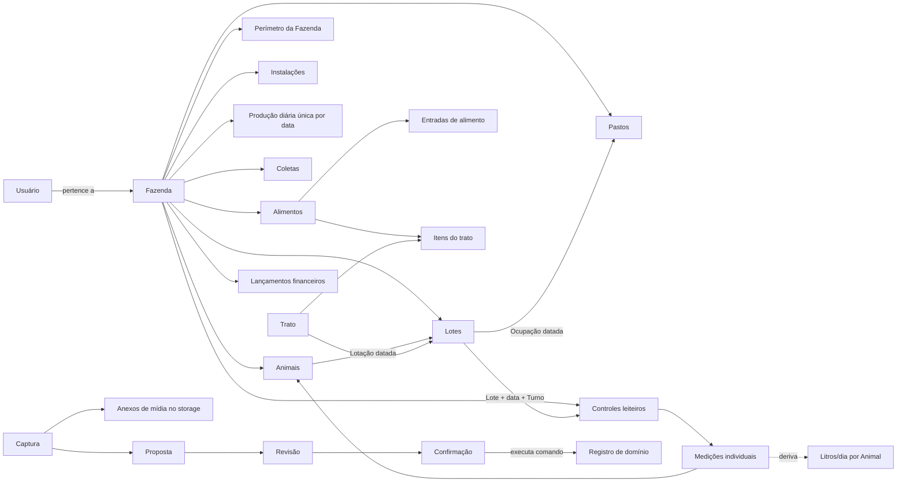

# Ontologia operacional

Esta ontologia descreve conceitos do negócio, fatos, relações e invariantes. Ela
não exige RDF/OWL no V1; o objetivo é manter linguagem, banco, API, IA e UI
semanticamente alinhados.

## Contextos delimitados

| Contexto | Responsabilidade | Conceitos principais |
| --- | --- | --- |
| Identidade | Autenticar e resolver a fronteira de dados | Usuário, Fazenda, Sessão |
| Rebanho | Identificar animais e manejo em grupos | Animal, Lote, Lotação |
| Espaço | Representar a fazenda física e ocupações | Mapa, Perímetro da Fazenda, Pasto, Instalação, Ocupação |
| Leite | Registrar fatos independentes de leite | Produção diária, Controle, Turno, Medição, Coleta |
| Análise leiteira | Comparar fatos confirmados sem extrapolar lacunas | Desempenho leiteiro, Cobertura, Tendência |
| Alimentação | Registrar entradas e consumo | Alimento, Entrada, Trato, Item do trato, Saldo |
| Financeiro | Registrar caixa previsto e realizado | Receita, Despesa, Liquidação |
| Assistente | Converter entrada humana em proposta revisável | Captura, Anexo da Captura, Proposta, Revisão, Confirmação |

## Mapa conceitual

## Tipos de informação

| Tipo | Regra |
| --- | --- |
| Fato confirmado | Entra em históricos e indicadores conforme sua semântica |
| Proposta | Não entra em nenhum indicador operacional |
| Medição | Preserva unidade, valor, instante e origem |
| Estimativa | Deve ser rotulada e nunca persistida como Medição |
| Ausência | Continua ausente; não vira zero |
| Exclusão | Preserva auditoria e deixa de participar de cálculos definidos |

## Invariantes iniciais

1. Todo Registro operacional possui `farm_id`.
2. Um comando só acessa dados do `farm_id` resolvido na Sessão.
3. Produção diária, Controle leiteiro e Coleta não se sobrescrevem.
4. Existe no máximo uma Produção diária por data na Fazenda; ela é um valor
   único, sem turno e sem escopo de Lote.
5. Existe no máximo um Controle leiteiro por combinação de Lote, data e Turno
   (manhã, tarde ou única); uma sessão contém no máximo uma Medição individual
   por Animal.
6. O Turno única é obrigatório para Lotes com `milkingsPerDay = 1`; Lotes com
   `milkingsPerDay = 2` usam manhã e tarde.
7. Uma Medição individual é um valor em litros com 1 casa decimal, referente a
   uma única Ordenha, e pertence a um Controle leiteiro e a um Animal da mesma
   Fazenda.
8. Litros/dia é métrica derivada (soma das Ordenhas do Animal na data) e nunca
   é persistida como Medição.
9. Um Animal possui no máximo uma Lotação aberta.
10. Um Lote ocupa no máximo um Pasto por vez; um Pasto abriga no máximo um Lote
    por vez.
11. O Saldo de alimento é derivado e não editável diretamente.
12. Uma Confirmação é idempotente: repetir a mesma solicitação não cria fatos
    duplicados.
13. A Captura original, o texto extraído literalmente de mídia, seus metadados
    de Anexo e a Proposta interpretada permanecem consultáveis para auditoria,
    respeitando retenção e privacidade; extração (OCR/transcrição) não é
    interpretação e bytes de áudio, imagem e documento ficam no storage, nunca
    no PostgreSQL.
14. Resultado de caixa considera apenas lançamentos liquidados e não recebe o
    nome de lucro.
15. Uma comparação entre Animais sempre informa período, quantidade de dias
    medidos e Cobertura de dados (dias medidos / dias com Controle no período).
16. Desempenho leiteiro não é sinônimo de mérito genético nem recomendação
    automática de descarte.
17. A Imagem de satélite é uma referência cartográfica externa. Ela não
    substitui a geometria confirmada de Pasto/Instalação nem cria Ocupação.
18. O Perímetro da Fazenda é um único polígono oficial por Fazenda, editável
    por comando explícito e auditado; sua ausência não é inferida da imagem.
19. Ausência de Medição em um Turno permanece ausência: nunca vira zero.

## Modelo relacional mínimo recomendado

- `farms`
- `users` com `farm_id` obrigatório e único no V1
- `animals` (nome/brinco + status ativo/arquivado), `herd_groups` (com
  `milkings_per_day`), `animal_group_assignments`
- `farm_boundaries`, `pastures`, `installations`, `pasture_occupancies`
- `daily_milk_productions` (única por `farm_id` + data)
- `milk_control_sessions` (única por Lote + data + turno),
  `individual_milk_measurements` (única por sessão + animal)
- `milk_collections`
- views/queries derivadas de análise leiteira (litros/dia, cobertura), sem
  duplicar fatos
- `feed_items`, `feed_entries`, `feeding_events`, `feeding_event_items`
- `financial_entries`
- `assistant_captures`, `assistant_capture_attachments`,
  `assistant_proposals`, `assistant_confirmations`
- `audit_events`

Tabelas operacionais carregam `farm_id` mesmo quando ele poderia ser alcançado
por joins. A redundância é deliberada para tornar isolamento, índices e
auditoria explícitos.

## Conceitos rejeitados no V1

Não criar entidades ou enums para Plantio, Mastite, Cio, Peso, Cobertura,
Prenhez, Parto, Reprodução, parentesco, genealogia ou genômica. Dados antigos
desses domínios podem ser exportados para arquivo histórico, mas não orientam o
novo modelo.

## Questões ainda abertas

- Retenção de Capturas brutas de áudio, imagem e documento.
